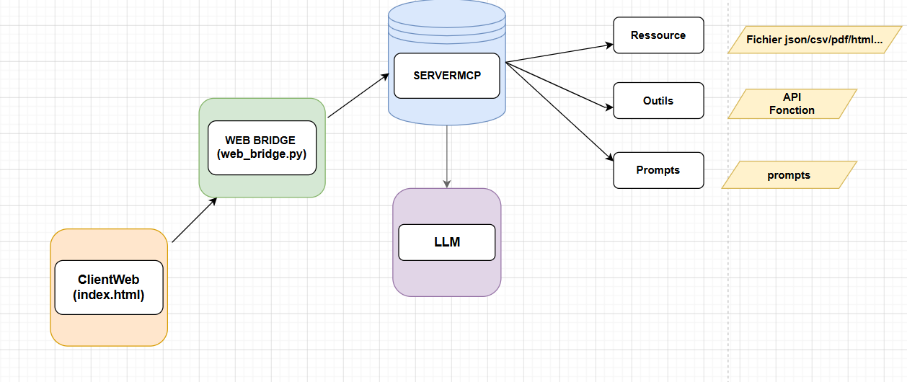
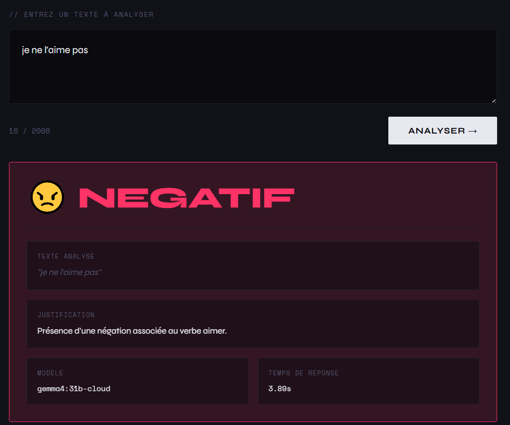
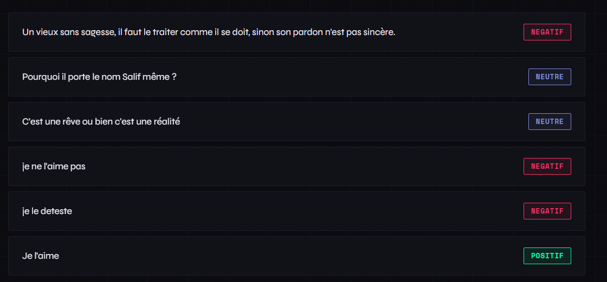

# 🧠 SentimentMCP

> Analyse automatique de sentiments via **Ollama** + **Model Context Protocol (MCP)**  
> Interface web moderne + serveur MCP Python

---

## 📋 Table des matières

1- [Présentation](#présentation)

2- [Architecture](#architecture)

3- [Prérequis](#prérequis)

4- [Installation](#installation)

5- [Lancement](#lancement)

6- [Utilisation](#utilisation)

7- [Structure du projet](#structure-du-projet)

8- [Bugs corrigés](#bugs-corrigés)

9- [API du bridge](#api-du-bridge)

---

## Présentation

**SentimentMCP** est un outil d'analyse de sentiments qui classe automatiquement un texte en :

- ✅ **Positif**
- ❌ **Négatif**
- ➖ **Neutre**

Il combine deux composants :

- `ServerMCP/` — Un serveur [MCP (Model Context Protocol)](https://modelcontextprotocol.io) qui expose des outils d'analyse via Ollama. Compatible avec Claude Desktop et tout client MCP.

- `ClientWeb/` — Une interface web moderne pour analyser des textes directement depuis le navigateur.

---

## Architecture du projet



---

## Prérequis

| Outil | Version minimale | Utilité |
|-------|-----------------|---------|
| Python | 3.10+ | Serveur MCP + bridge HTTP |
| [Ollama](https://ollama.com) | Dernière version | Moteur LLM local |
| Modèle deepseek | `gemma4:31b-cloud` | Analyse de sentiment |

---

## Installation

### 1. Cloner ou télécharger le projet

```
MonProjet/
├── ServerMCP/
└── ClientWeb/
```

### 2. Installer les dépendances Python

```bash
pip install mcp requests
```

### 3. Installer et démarrer Ollama

```bash
# Télécharger Ollama sur https://ollama.com
# Puis démarrer le service
ollama serve

# Télécharger le modèle
ollama pull gemma4:31b-cloud
```

---

## Lancement

### Option A — Interface web (recommandé)

```bash
# Dans le dossier ClientWeb/
python web_bridge.py
```

Puis ouvrir dans le navigateur :
```
http://localhost:8765
```

> ⚠️ Ne pas ouvrir `index.html` directement par double-clic — toujours passer par `http://localhost:8765`.


---

## Utilisation

### Interface web

| Fonctionnalité | Description |
|----------------|-------------|
| **Zone de saisie** | Tapez ou collez un texte à analyser |
| **Ctrl + Entrée** | Raccourci clavier pour lancer l'analyse |
| **Résultat coloré** | 🟢 Positif / 🔴 Négatif / 🔵 Neutre avec justification |
| **Historique** | Les 10 dernières analyses de la session, cliquables |
| **Dataset** | Bouton "Charger" pour afficher les 45 commentaires du JSON, cliquables pour les analyser directement |

### Outils MCP disponibles

| Outil | Description |
|-------|-------------|
| `analyze_sentiment_tool(comment)` | Analyse le sentiment d'un texte |
| `analyze_all_comments()` | Analyse tous les commentaires du dataset |
| `tester_serveur()` | Vérifie que le serveur fonctionne |

### Ressource MCP

| Ressource | Description |
|-----------|-------------|
| `comments://all` | Retourne tous les commentaires du dataset JSON |

### Prompt MCP

| Prompt | Description |
|--------|-------------|
| `sentiment_rules` | Charge les règles d'analyse depuis `sentiment.txt` |

---

## Structure du projet

```
MonProjet/
│
├── ServerMCP/                        # Serveur MCP
│   ├── server.py                     # Point d'entrée MCP
│   ├── requirements.txt              # Dépendances Python
│   ├── tools/
│   │   └── sentiment_tools.py        # Client Ollama
│   ├── prompts/
│   │   └── sentiment.txt             # Règles d'analyse (prompt système)
│   └── ressources/
│       └── commentaires_plat.json    # Dataset de 45 commentaires
│
└── ClientWeb/                        # Interface web
    ├── web_bridge.py                 # Pont HTTP (port 8765)
    └── index.html                    # Interface utilisateur
```

---


## API du bridge

Le `web_bridge.py` expose une mini API HTTP locale :

### `GET /health`
Vérifie que le serveur est opérationnel.
```json
{ "status": "ok" }
```

### `GET /comments`
Retourne tous les commentaires du dataset JSON.
```json
[
  { "commentaire_id": 1, "Auteur": "...", "Commentaires": "...", "Likes": "2" },
  ...
]
```

### `POST /analyze`
Analyse le sentiment d'un texte.

**Corps de la requête :**
```json
{ "text": "Ce gouvernement fait un excellent travail." }
```

**Réponse :**
```json
{
  "success": true,
  "data": {
    "content": "Ce gouvernement fait un excellent travail.",
    "commentaire_id": null,
    "sentiment": "positif",
    "justification": "Adjectif élogieux 'excellent' exprimant une approbation claire."
  }
}
```

---

## Format de sortie 

Le modèle retourne toujours un JSON structuré 



---


## 📄 Licence

© 2025 [Somé Mwin-Tour Yves Roland]. Tous droits réservés.

Ce projet est privé et protégé par le droit d'auteur. 
Aucune utilisation, modification ou distribution n'est autorisée sans permission écrite.
